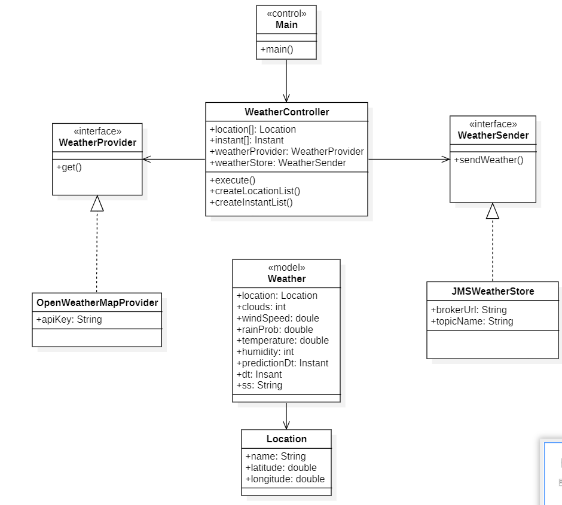
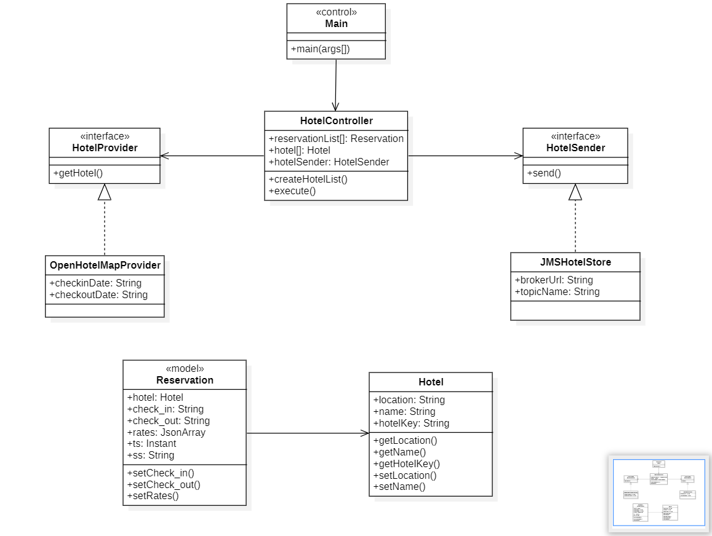
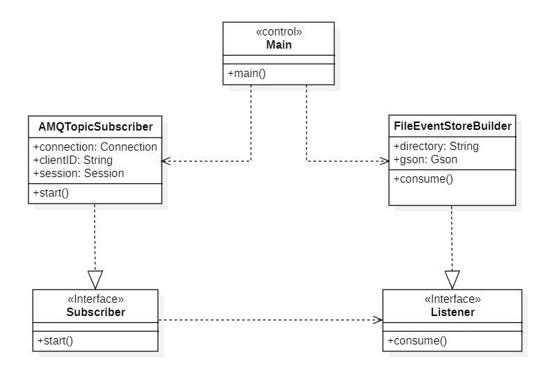
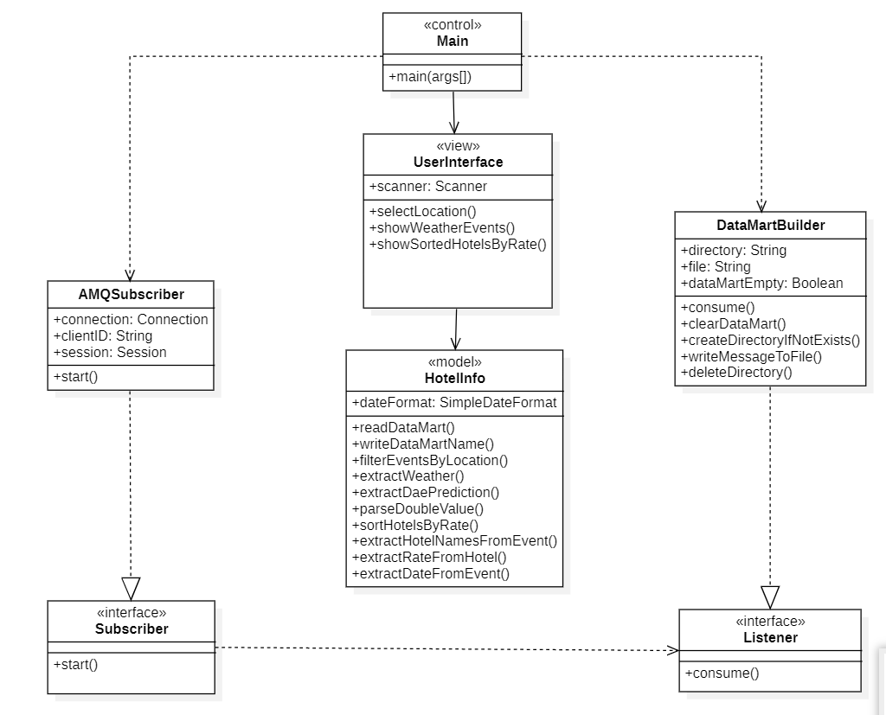

# WeatherProject  
Subject: Data Science Applications Development  
Course: 2023/24  
Degree: Data Science and Engineering  
School: Higher Technical School of Computer Engineering  
University: University of Las Palmas de Gran Canaria  

## __Prediction Provider Module__
## Summary of Functionality
The Prediction Provider module is responsible for retrieving weather data from the OpenWeatherMap API, processing it, and sending predictions to a message broker using Java Message Service (JMS). It consists of the following components:

**OpenWeatherMapProvider Class**: Implements the WeatherProvider interface and fetches weather data from the OpenWeatherMap API based on location and timestamp.

**JMSWeatherStore Class**: Implements the WeatherSender interface and sends weather data to a specified JMS topic using the ActiveMQ message broker.

**WeatherController Class**: Orchestrates the interaction between the OpenWeatherMapProvider and JMSWeatherStore. It retrieves weather data for predefined locations and timestamps, prints the data to the console, and sends it to the JMS topic.

**MainSender Class**: Contains the main method to instantiate a WeatherController and schedule periodic weather data retrieval and sending tasks.

## Design
### Responsibilities:

**OpenWeatherMapProvider**: Fetches weather data from the OpenWeatherMap API and parses the JSON response.
**JMSWeatherStore**: Sends weather data to a JMS topic using the ActiveMQ message broker.
**WeatherController**: Coordinates the retrieval and sending of weather data.

### Collaboration:

WeatherController collaborates with OpenWeatherMapProvider and JMSWeatherStore to fetch and send weather data, respectively.

### Design Principles:

Follows the Single Responsibility Principle (SRP) by assigning specific responsibilities to each class.
Utilizes dependency injection in WeatherController to facilitate testing and flexibility.

## __Hotel Rates Provider Module__ 
## Summary of Functionality
The Hotel Rates Provider module is responsible for retrieving hotel data from a specified source, processing it, and sending predictions to a message broker using Java Message Service (JMS). It focuses on hotel rates for the Canary Islands. The module includes the following components:

**Reservation Class**: Represents a hotel reservation with details such as hotel information, check-in and check-out dates, rates, timestamp, and source.

**Hotel Class**: Represents hotel details including location, name, and a unique hotel key.

**OpenHotelMapProvider Class**: Implements the HotelProvider interface and fetches hotel data from a designated source based on the specified check-in and check-out dates.

**JMSHotelStore Class**: Implements the HotelSender interface and sends hotel reservation data to a specified JMS topic using the ActiveMQ message broker.

**HotelController Class**: Orchestrates the interaction between the OpenHotelMapProvider and JMSHotelStore. It retrieves hotel data for predefined locations, check-in, and check-out dates, prints the data to the console, and sends it to the JMS topic.

**MainHotelRatesSender Class**: Contains the main method to instantiate a HotelController and schedule periodic hotel data retrieval and sending tasks.

## Design
### Responsibilities:
**Reservation**: Represents a hotel reservation with associated details.
**OpenHotelMapProvider**: Fetches hotel data from a specified source based on check-in and check-out dates.
**JMSHotelStore**: Sends hotel reservation data to a JMS topic using the ActiveMQ message broker.
**HotelController**: Coordinates the retrieval and sending of hotel reservation data.

### Collaboration:
HotelController collaborates with OpenHotelMapProvider and JMSHotelStore to fetch and send hotel data, respectively.

### Design Principles:
Follows the Single Responsibility Principle (SRP) by assigning specific responsibilities to each class.
Utilizes dependency injection in HotelController to facilitate testing and flexibility.

## __DataLake Builder Module__
## Summary of Functionality
The DataLake Builder module is responsible for subscribing to a JMS topic, receiving event data, and creating a datalake with separate repositories for both weather and hotel events. The module includes the following components:

**AMQTopicSubscriber Class**: Implements the Subscriber interface and connects to ActiveMQ as a durable topic subscriber. It listens for both weather and hotel events and delegates processing to a provided Listener.

**FileEventStoreBuilder Class**: Implements the Listener interface and processes incoming messages, extracting relevant data, and storing them in separate repositories based on event type.

## Design
### Responsibilities:
**AMQTopicSubscriber**: Connects to ActiveMQ, subscribes to a JMS topic, and delegates message processing to a provided Listener.
**FileEventStoreBuilder**: Processes incoming messages, extracts data, organizes events into separate repositories for weather and hotel events, and persists them in files.

### Collaboration:
AMQTopicSubscriber collaborates with the FileEventStoreBuilder to handle incoming messages.
FileEventStoreBuilder uses Gson for JSON parsing and file I/O operations to store events.

### Design Principles and Patterns:
Adheres to the Single Responsibility Principle (SRP) and Dependency Inversion Principle (DIP).
Implements the Observer Pattern in AMQTopicSubscriber for asynchronous message processing.

## __Business Unit Module__
## Summary of Functionality
The Business Unit module is structured as an MVC (Model-View-Controller) architecture. It interacts with the data obtained from both weather and hotel events, creating a datamart with today's events and providing a user interface for interacting with the system. The module includes the following components:

**AMQSubscriber Class**: Implements the Subscriber interface and connects to ActiveMQ as a non-durable topic subscriber. It listens for both weather and hotel events and delegates processing to a provided Listener.

**DataMartBuilder Class**: Implements the Listener interface and processes incoming messages, extracting relevant data, and creating a datamart with today's events.

**HotelInfo Class**: Contains utility methods for reading datamart files, generating file names, filtering events by location, extracting weather data, and sorting hotels by rate.

**UserInterface Class**: Provides a simple console-based user interface for choosing an island destination and displaying weather and hotel information. The answer of the user should be the name of the Canary Island where the user want to find the best hotels sorted by their price and the weather predictions.

## Design
### Responsibilities:
**AMQSubscriber**: Connects to ActiveMQ, subscribes to JMS topics, and delegates message processing to a provided Listener.
**DataMartBuilder**: Processes incoming messages, extracts data, creates a datamart with today's events, and stores them in files.
**HotelInfo**: Provides utility methods for reading datamart files, generating file names, and processing hotel and weather events.
**UserInterface**: Interacts with the user, gathers input, and displays weather and hotel information.

### Collaboration:
AMQSubscriber collaborates with DataMartBuilder to handle incoming messages.
DataMartBuilder uses Gson for JSON parsing and file I/O operations to store events.
UserInterface interacts with HotelInfo to display weather and hotel information to the user.

### Design Principles and Patterns:
Follows the Model-View-Controller (MVC) architectural pattern for a clear separation of concerns.
Adheres to the Single Responsibility Principle (SRP) by assigning specific responsibilities to each class.

## Conclusion

In summary, the system comprises four interconnected modules. The Prediction Provider module handles weather prediction, while the Hotel Rates Provider module focuses on hotel data. The DataLake Builder module acts as an intermediary, 
creating separate repositories. The Business Unit module utilizes the MVC pattern to build a datamart and provide a user interface. Principles like SRP and DIP are applied, and dependency injection is used for flexibility and effective testing. 
Overall, the system offers a modular, maintainable, and scalable solution for managing weather and hotel data, with an intuitive user interface.
### Prediction Provider Class Diagram

### Hotel Rates Provider Class Diagram

### DataLake Builder Class Diagram

### Business Unit Class Diagram

